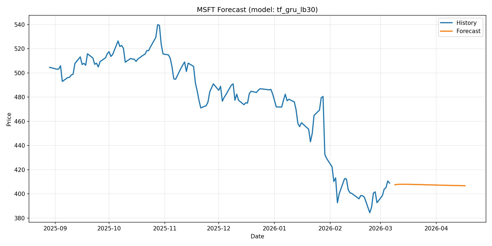
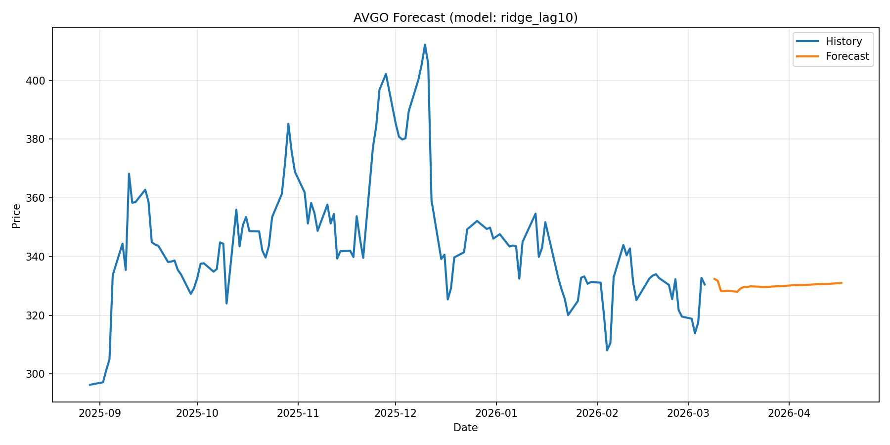

# 📈 Telegram Bot for Stock Forecasting

Телеграм-бот для **анализа и прогнозирования цен акций** с использованием методов анализа временных рядов и машинного обучения.

Бот автоматически загружает исторические данные акций, обучает несколько моделей прогнозирования, выбирает лучшую по метрикам качества и строит прогноз на **30 дней вперёд**.

Проект создан в **учебных целях** для практики работы с временными рядами, ML-моделями и разработкой Telegram-ботов.

---

## 🚀 Возможности бота

Бот умеет:

- 📊 Загружать исторические данные акций из **Yahoo Finance**
- 🤖 Обучать несколько моделей прогнозирования
- 📉 Выбирать лучшую модель по метрикам качества
- 📈 Строить прогноз цены акции на **30 дней**
- 📊 Отправлять пользователю **график истории и прогноза**
- 💰 Формировать рекомендации **BUY / SELL**
- 🧮 Рассчитывать **потенциальную прибыль стратегии**
- 📝 Сохранять все запросы пользователя в **лог-файл**

---

## 🔄 Pipeline проекта

```text
User Input
    ↓
Data Loading
    ↓
Feature Generation
    ↓
Model Training
    ↓
Model Evaluation
    ↓
Forecast Generation
    ↓
Trading Signals
    ↓
Telegram Response
```
## 🧠 Используемые модели

В проекте реализовано несколько подходов к прогнозированию временных рядов:

| Модель | Тип |
|------|------|
| Baseline (Last Value) | простая базовая модель |
| Ridge Regression (lag features) | классическая ML-модель |
| ARIMA (1,1,1) | статистическая модель временных рядов |
| GRU Neural Network | нейросетевая модель |

Лучшая модель выбирается автоматически на основе метрик:

- **RMSE**
- **MAPE**

---

## 📊 Пример использования



.jpg)

Бот возвращает:

- 📈 прогноз цены через 30 дней  
- 📊 график истории и прогноза  
- 💰 расчёт потенциальной прибыли  
- 📉 рекомендации по покупке и продаже  

---

## 🗂 Структура проекта

```text
stock-forecast-telegram-bot/
│
├── main.py               # Telegram bot entry point
├── logic.py              # Main forecasting pipeline
├── models.py             # Forecasting models
├── metrics.py            # RMSE / MAPE metrics
├── data.py               # Yahoo Finance data loading
├── visualization.py      # Forecast plotting
├── test_logic.py         # Unit tests
├── requirements.txt
└── .gitignore
```


---

## ⚙️ Установка и запуск

### 1. Клонировать репозиторий

git clone https://github.com/USERNAME/stock-forecast-telegram-bot.git


### 2. Установить зависимости

pip install -r requirements.txt


### 3. Создать файл `.env`

В корне проекта создать файл:

.env


и добавить токен Telegram-бота:

BOT_TOKEN=your_telegram_bot_token


### 4. Запустить бота

python main.py


После запуска бот начнёт принимать сообщения в Telegram.

---

## 📂 Логирование

Каждый запрос пользователя сохраняется в файл:

logs.csv


Лог содержит:

- время запроса
- ID пользователя
- тикер акции
- сумму инвестиции
- выбранную модель
- RMSE / MAPE
- рассчитанную прибыль

---

## ⚠️ Дисклеймер

Данный проект создан **исключительно в учебных целях**.

Прогнозы и торговые рекомендации **не являются инвестиционным советом**.

---

## 🛠 Используемые технологии

- Python  
- Telegram Bot API  
- pandas  
- numpy  
- scikit-learn  
- statsmodels  
- TensorFlow / Keras  
- yfinance  
- matplotlib  

---

## 🚧 Future Improvements

- Add LSTM-based forecasting
- Add real-time streaming
- Deploy bot to cloud server
- Add portfolio optimization
- Improve trading strategy logic

---

## 📚 Цель проекта

Проект демонстрирует практическое применение:

- анализа временных рядов  
- машинного обучения  
- нейронных сетей  
- разработки Telegram-ботов  
- построения простых торговых стратегий


